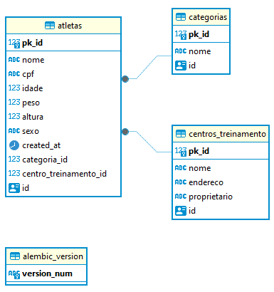

# dio-workout-api
Projeto para o curso da dio.me de API com FastAPI, Python e Docker.

# O que é?
É uma API de uma competição de crossfit chamada de WorkoutAPI. É uma API pequena com apenas 3 tabelas para treinar e aplicar os conceitos aprendidos, como por exemplo utilizar o FastAPI.

# Modelo Entidade-Relacionamento


# Execução
Optei por utilizar o ambiente virtual do próprio python, o venv.
Assim, para rodar o ambiente virtual execute o código:
```
.\.workoutapi\Scripts\activate
```
E depois, para instalar os requirements caso falte algum:
```
pip install -r requirements.txt
```
Para executar o docker (docker-compose), criar uma nova migração e rodar essa migração, criando o banco de dados, use os comandos (todos esses comandos estão no arquivo Makefile): 
```
make docker-up
make create-migrations d="init_db" 
make run-migrations
```
Para subir a API, também utilizando o Makefile, utilize o comando:
```
make run
```
e acesse: http://127.0.0.1:8000/docs
